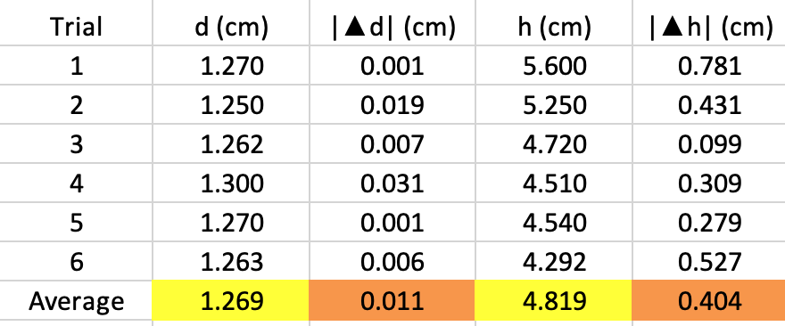
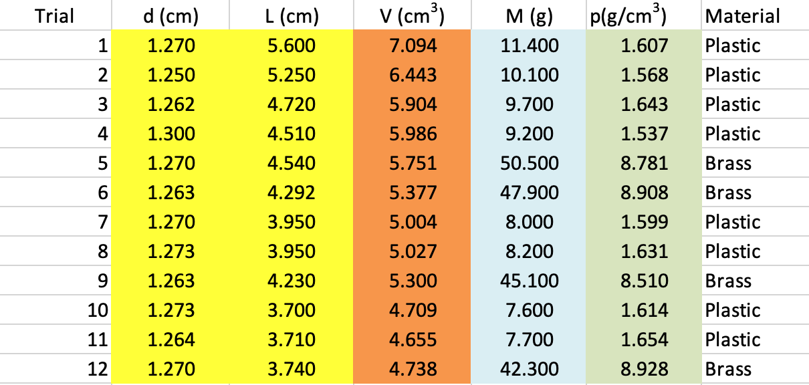
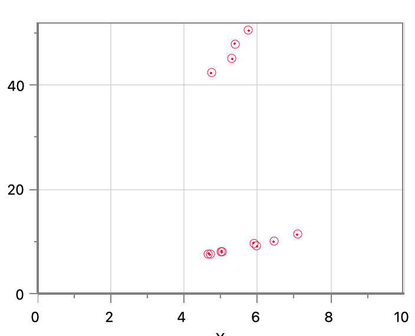

## 1. Introduction

The concept of density is fundamental in physics and has wide-ranging applications in various fields of science and engineering. This laboratory experiment focuses on understanding density through practical measurements and calculations. By exploring the relationship between mass, volume, and density, we aim to develop a deeper comprehension of this crucial physical property and its significance in material characterization.

## 2. Objectives

- To understand the concept of density and its relationship to mass and volume
- To measure the mass and volume of various cylinders accurately
- To calculate the density of different materials using experimental data
- To compare the calculated densities with known values and analyze any discrepancies/uncertainty
- To explore the applications of density measurements in real-world scenarios

## 3. Materials

- Mistery Density Set
- Digital balance (precision: 0.01g)
- Graduated cylinder (100mL)
- Vernier caliper
- Ruler
- Calculator
- Lab notebook and writing utensils
- Logger Pro Software

## 4. Concepts

### Density
Density is defined as the mass per unit volume of a substance. It is expressed mathematically as:

$$\rho = \frac{m}{V}$$

Where:

$$\rho (rho) = density ( typically in $\frac{g}{cm³}$ or $\frac{kg}{m³}$ )$$

$$m = mass (in grams or kilograms)$$

$$V = volume (in cm³ or m³)$$

### Mass Measurement
Mass is measured using a balance or scale. In this lab, we use a digital balance for precise measurements.

### Volume Measurement
Volume can be measured directly for regularly shaped objects using dimensional measurements. For irregularly shaped objects, the displacement method using a graduated cylinder is employed.

### Significant Figures
Proper use of significant figures in measurements and calculations is crucial for expressing the precision of our results.

### Error Analysis
Understanding and calculating experimental errors, including percent error, helps in assessing the accuracy of our measurements and results.

## 5. Procedure
1.  First, the six largest cylinders are selected from the set. The caliper is used to measure their diameter in centimeters and the ruler is then used to measure their height in centimeters. The measurements are recorded on Table 1, including the uncertainty given by the measuring tool.

2.  The average diameter and average height of the cylinder set is calculated with the following equation.

$$\overline{x} = {\sum_{i=1}^{N} x_{i}\over N}$$

3.  Then the absolute error is determined in the set of measurements. First by     finding the absolute value of the difference between each measurement and their average and record in table 1. Then find the average of the difference with:

$$\Delta{x} = {\sum_{i=1}^{N} |x_{i} -\overline{x}|\over N}$$

4.  Then record the diameter and length using the average, absolute error format. 

$$x = \overline{x} \pm \Delta{x}$$

5.  After, determine the relative error in the measurements:

$$\delta{x} = {\frac{\Delta{x}}{\overline{x}}}$$

6.  And lastly, Determine the cylinder's average Volume and its corresponding absolute error.

7.  To find the Density of the materials the caliper and ruler are used to measure the diameter and length of the 15 cylinders the measurements are then recorded in the data table 2.

8.  The volume of each cylinder is calculated and recorded in Table 2. Then the digital scale is used to determine the mass of each cylinder which is recorded in table 2. 

9.  The density of each cylinder is then calculated and recorded in data table 2. Use logger Pro and graph Mass to get Volume. Then Determine the mathematical relationship between mass and volume. 

## 6. Data Table

### 6.1 Table 1: Measurements and Uncertainties

### 6.2 Table 2: Densities

### 6.3 Chart 1: Mass vs Volumen

## 7. Analysis

### 7.1  Why is the relative error of the length larger than that of the diameter?

The relative error in the measurement of length is greater than that of the diameter because the variation in the average of the length values is larger compared to the variation in the average of the diameter values. 

$$|\Delta d| (cm) = 0.011$$

$$|\Delta h| (cm) = 0.404$$

### 7.2  What is the meaning of the slope of the lines in your Mass vs. Volume graph?

The slope of the graph represents the ratio of change in quantity of the y-axis and the change in quantity of the x-axis. It means that there is a directly proportional relationship between the mass of an object and its volume, that is, the greater the mass and volume, the greater the density and vice versa. 

### 7.3  Based on your results from Table 2 and your graph, are all cylinders made from the same material? Explain

No, the data is grouped into two different segments, which means that the cylinders are at least made of two different materials, since their density is different. 

### 7.4  Some cylinders are made of acetyl, and others are made of polystyrene.
### Their corresponding densities are 1.04 g/cm3 and 1.42 g/cm3 :

- Complete the last column of Table 2 by identifying the material used in making a given cylinder. 
- Determine your percentage errors in your slopes. 
- Determine the average density for each set of six cylinders and its absolute error.

## 8. Conclusions

In this laboratory experiment, we have explored the fundamental concept of density through hands-on measurements and calculations. By measuring the mass and volume of various objects and subsequently calculating their densities, we have gained practical experience in applying physical principles to real-world scenarios.

Our results demonstrate the relationship between mass, volume, and density, and how these properties vary among different materials. We observed that [insert specific observations about the densities of different materials tested].

Through this experiment, we have also encountered the importance of precision in scientific measurements and the need for careful error analysis. The discrepancies between our calculated values and known densities highlight the challenges in achieving perfect accuracy in experimental settings and the importance of identifying potential sources of error.

This lab has reinforced our understanding of density as a key physical property and its relevance in material science, engineering, and everyday applications. Moving forward, we can apply this knowledge to more complex scenarios and continue to develop our skills in scientific measurement and analysis.
